  

  

  

---

  

---

### Tech Stack

  

  
  
  
  
  
  

---

### How I Build

  

  <picture>
    <source media="(prefers-color-scheme: dark)" srcset="https://raw.githubusercontent.com/aryann2611/aryann2611/output/github-snake-dark.svg" />
    <source media="(prefers-color-scheme: light)" srcset="https://raw.githubusercontent.com/aryann2611/aryann2611/output/github-snake.svg" />
    
  </picture>

  

